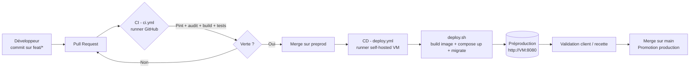
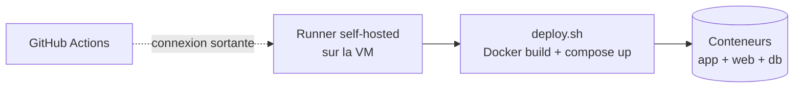

# CI/CD — Intégration et déploiement continus (CESIZen)

Ce document décrit l'ensemble de la chaîne CI/CD du projet : le versioning, les
contrôles automatisés (CI), le déploiement automatisé (CD) vers la
préproduction, et l'outillage de veille associé.

---

## 1. Objectifs

- **Fiabiliser** chaque changement : aucun code non testé ni non conforme ne
  part en préproduction.
- **Automatiser** la livraison : un `git push` déclenche build, tests et
  déploiement sans intervention manuelle.
- **Tracer** : chaque version déployée correspond à un commit identifié.

## 2. Vue d'ensemble du pipeline

## 3. Versioning (Git)

| Élément | Convention |
|---------|-----------|
| Hébergement | GitHub — `github.com/ilionnnn/b2-solo` |
| Branche production | `main` |
| Branche préproduction / recette | `preprod` |
| Branches de travail | `feat/*` (évolution), `fix/*` (correction) |
| Intégration | Pull Request obligatoire, CI verte avant merge |
| Versions | SemVer `MAJEUR.MINEUR.CORRECTIF` |

## 4. Intégration continue — `ci.yml`

**Fichier** : `.github/workflows/ci.yml` — s'exécute sur les runners hébergés
par GitHub (Ubuntu), **automatiquement**, sans installation.

**Déclencheurs** : `push` et `pull_request` sur `main` et `preprod`.

**Matrice** : PHP 8.2 et 8.3 (vérifie la compatibilité sur deux versions).

**Étapes** :

| # | Étape | Commande | But |
|---|-------|----------|-----|
| 1 | Dépendances PHP | `composer install` | Installe le projet |
| 2 | **Audit sécurité** | `composer audit` | Détecte les dépendances vulnérables |
| 3 | **Style de code** | `vendor/bin/pint --test` | Impose une structure de code homogène |
| 4 | **Build front** | `npm ci && npm run build` | Vérifie la compilation des assets |
| 5 | **Tests** | `php artisan test` | Exécute la suite (SQLite en mémoire) |

Si une étape échoue, le workflow est rouge et le merge est bloqué (*fail fast*).

## 5. Déploiement continu — `deploy.yml`

**Fichier** : `.github/workflows/deploy.yml`.

**Déclencheurs** : `push` sur `preprod`, ou lancement manuel (`workflow_dispatch`).

**Cible** : `runs-on: [self-hosted, preprod]` — un **runner self-hosted**
installé sur la VM de préproduction.

**Étapes** : checkout du code → exécution de `deploy.sh`.

### 5.1 Pourquoi un runner self-hosted ?

La VM de préproduction est une VM VirtualBox derrière NAT/bridge sur le poste :
elle n'est **pas joignable depuis le cloud GitHub**. Un runner self-hosted
résout ce point : il est installé **sur la VM**, établit une connexion
**sortante** vers GitHub, récupère les jobs et les exécute localement. Aucun
port entrant à ouvrir, aucun tunnel.

### 5.2 Le script `deploy.sh`

`bloc2-solo/deploy.sh` (idempotent, utilisable manuellement ou par le runner) :

1. Build de l'image (`--network=host` pour le DNS d'entreprise, base Debian).
2. `docker compose up -d` (app PHP-FPM + Nginx + MySQL).
3. L'entrypoint applique migrations + mise en cache.
4. Nettoyage des images orphelines + état des conteneurs.

## 6. Environnements

| Environnement | Rôle | Déploiement |
|---------------|------|-------------|
| Développement | Codage local | Manuel (`composer dev`) |
| **Préproduction** | Recette / démo (VM Debian + Docker) | **Auto** sur push `preprod` |
| Production | Service final | Manuel validé (promotion depuis `main`) |

## 7. Veille et sécurité du pipeline

- **Dependabot** (`.github/dependabot.yml`) : PR de mise à jour hebdomadaires
  (Composer, npm, GitHub Actions) + alertes de vulnérabilité.
- **Secrets hors du dépôt** : `.env` ignoré par Git ; les identifiants
  sensibles passent par les *Secrets/Environments* GitHub, jamais dans le code.
- **`composer audit`** intégré à la CI (échoue si une dépendance est vulnérable).

## 8. Démontrer le pipeline (soutenance)

1. Onglet **Actions** du dépôt → montrer un run **CI vert** (étapes détaillées).
2. Faire un `git push` sur `preprod` → montrer le **run CD** qui se lance et
   déploie sur la VM.
3. Rafraîchir `http://<vm>:8080` pour montrer la nouvelle version en ligne.
4. Montrer une **PR Dependabot** (veille automatisée).

## 9. Correspondance avec la grille d'évaluation

| Critère grille | Élément CI/CD |
|----------------|---------------|
| Outil de versioning configuré | Git + GitHub + workflows |
| Automatisation et intégration continue | `ci.yml` (Pint, audit, build, tests) |
| Environnement configuré avec automatisation | `deploy.yml` + runner + `deploy.sh` |
| Veille technologique | `dependabot.yml` + `composer audit` |
| Bonnes pratiques (structure du code) | Pint imposé en CI |

## 10. Mise en place du runner (résumé)

Détail complet en [05-preprod-vm.md](05-preprod-vm.md) §5 :

1. GitHub → *Settings → Actions → Runners → New self-hosted runner* (Linux x64).
2. Sur la VM : télécharger, `./config.sh --url ... --token ... --labels preprod`.
3. Installer en service : `sudo ./svc.sh install && sudo ./svc.sh start`.
4. Le runner doit appartenir au groupe `docker`.
